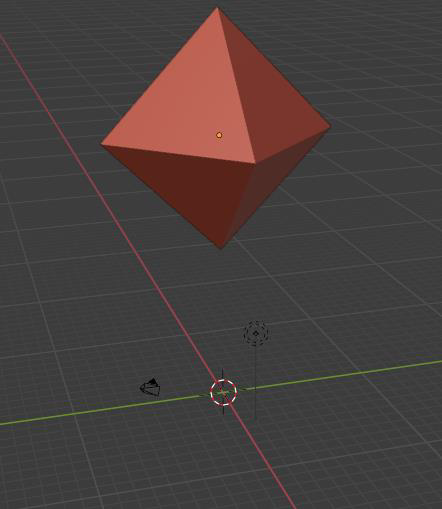
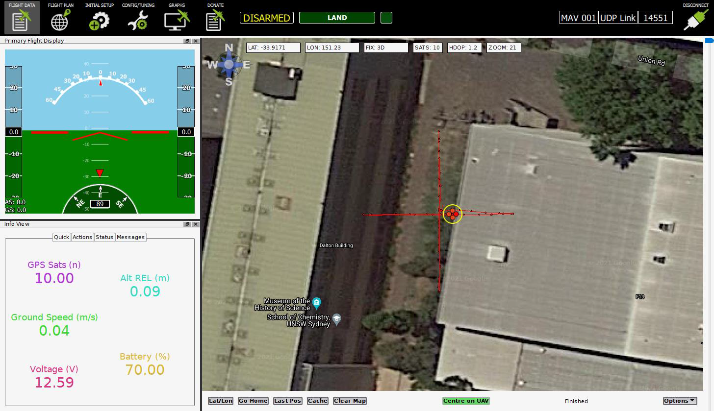
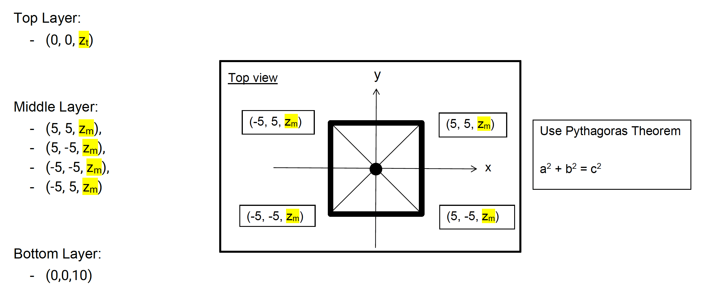
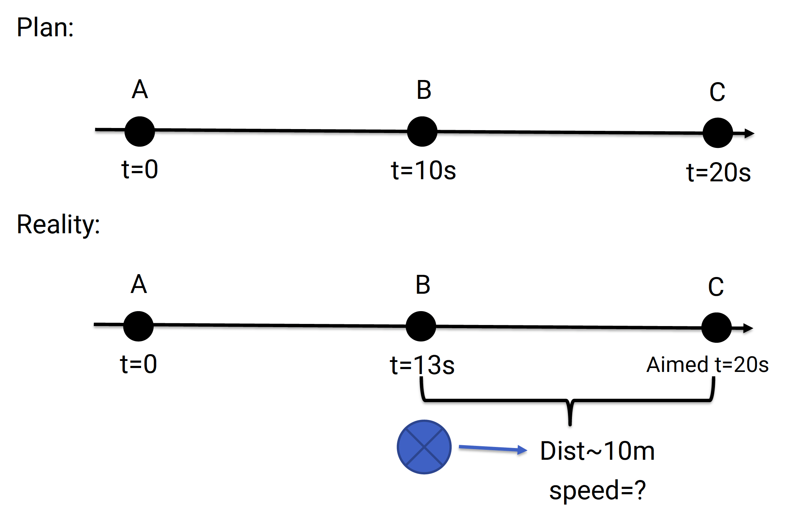
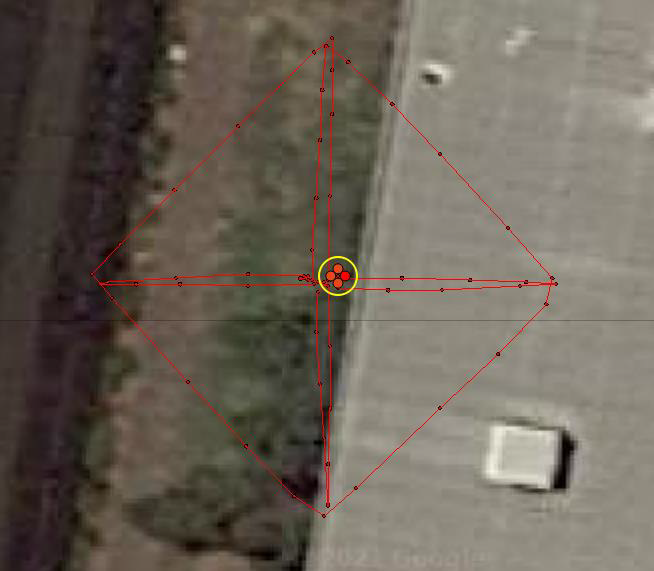
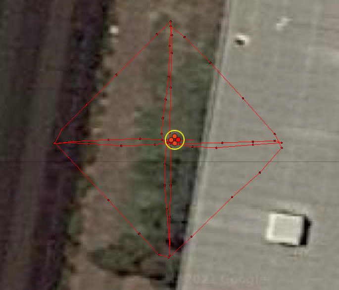

# drone-programming


This project aims to develop a robust flight script in python that can guide a drone to perform an automated flight on a 3D octahedron-shaped flight path with automatic spatio-temporal deviation detection and correction. 

## Requirements on Flight Script

The script should be capable of instructing the drone to perform the following actions:
1. take off and ascend to a specified altitude.
2. pattern flying - move to designated three-dimensional (xyz) waypoints to complete a octahedron flight path with spatio-temporal precision.
3. return to launching location and land.

During any automated flight, a drone can deviate from the intended path (in terms of position and time) as a result of various factors such as wind and fluctuations. The precision of the flight script is thus important to ensure safety and efficiency. It should automatically correct any deviations from the intended path.

## Flying Pattern
The Octahedron flying pattern:
- The octahedron should be ‘vertically’ positioned.
- The octahedron (the bottom corner) should locate 10 m above the ground.
- Each edge of the octahedron should be 10m long. Thus, the total length of the path would be (10m * 12 edges) 120m.
- The flight along each edge should take 10 seconds. Thus, the total time taken to complete the pattern flying would be 120 seconds.
- The flight can be performed with any sequence along the edges without any  repeated path. (Intersection is allowed.)

<p align="center"></p>


## Simulation Environment

The simulation environment for testing is shown as follows:
<p align="center"></p>


## Concept Ideas

### 3 layers of the octahedron & node coordinates (in x,y,z)

The octahedron can be componentized into 3 layers:

<p align="center"></p>

### Relative Positioning vs Absolute Positioning

|     | Relative Position    | Absolute Positioning    | 
|--------------|--------------|--------------|
| Overview    | “Move towards North for 5m.” The next waypoint is **relative to the current position** of the vehicle.   | “Move to (x,y,z).”. The waypoints are expressed in absolute coordinates.   | 
| Advantages    | - Allow the vehicle to adjust/ change the path depending on the current situation. <br> - Do not rely on positioning system (e.g. GPS)   | - Positional errors do not accumulate. <br> - Suitable for pre-determined path. | 
| Limitations    | Error propagation - any positional error in the current position will propagate onto the next waypoint.  | - Requires GPS or other positioning system for positional references. <br> - Path adjustment is not as easy. | 

Use relative positioning to adjust any locational deviations during manuveur, and absolute positioning in defining each node in the octahedron (i.e. initial location as (0,0,0) and other nodes in (x,y,z)) such that positional error at each node, if it exists, does not propagate to the next node.


### Speed Adjustment

<p align="center"></p>

A schedule of the estimated time of arrival was first created. At each timestamp (every second), the current movement progress is continuously monitored by repeatedly calculating the deviation between the current time and the schedule. The speed is then readjusted regularly to correct any recorded deviation.
 

## Results

- In multiple test runs of simulation, the total time taken to complete the entire octadedron path is perfectly 120 seconds (rounded to the nearest integer).
- The drone moves along the 12 edges of the 'diamond' with no repeated path.
- Positional errors are well-managed by the effective steps taken, which lead to great 
consistency of flight trajectories over several test runs of the simulation. 

Run 1:
<p align="center"></p>

Run 2:
<p align="center"></p>


## Installation Guide

Simulation software (Mission Planner): https://ardupilot.org/planner2/docs/installing-apm-planner-2.html

### Python Packages
```powershell
pip install opencv-python==4.2.0.32
pip install pymavlink==2.4.8
pip install dronekit
pip install dronekit_sitl
pip install mavproxy
```

### Run drone simulation
- Terminal 1:
```powershell
dronekit-sitl copter --home=-33.9171412,151.2295594,0,180
```
- Terminal 2:
```powershell
mavproxy.py --master tcp:127.0.0.1:5760 --out udp:127.0.0.1:14550 --out udp:127.0.0.1:14551
```

- Mission Planner 2: Connect to udp port: 14551

- Run the python script 

```powershell
python base.py
```